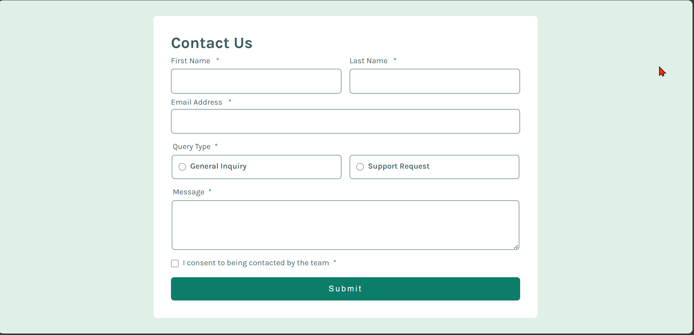
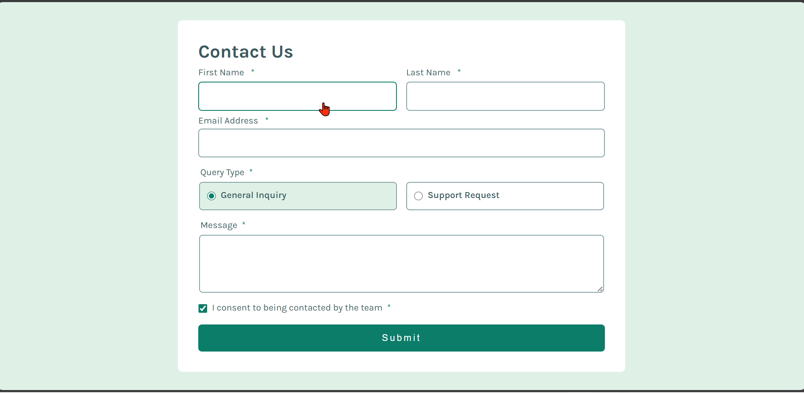
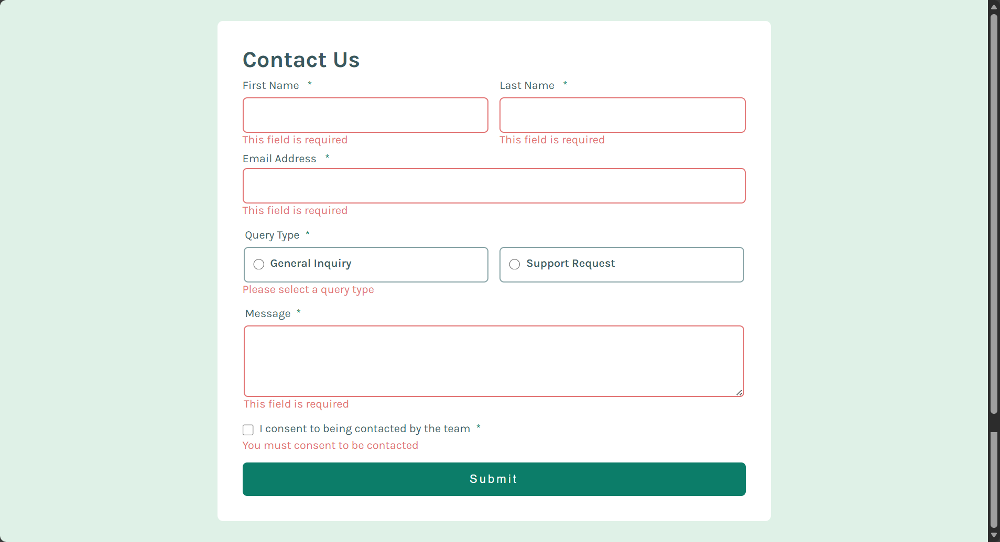
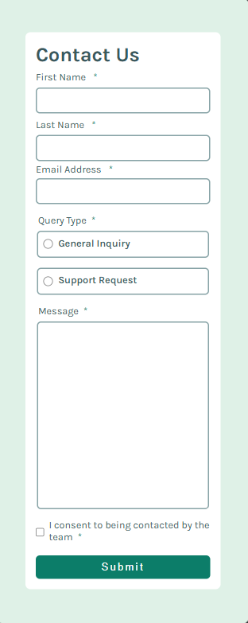

# Frontend Mentor - Contact form solution

This is a solution to the [Contact form challenge on Frontend Mentor](https://www.frontendmentor.io/challenges/contact-form--G-hYlqKJj). Frontend Mentor challenges help you improve your coding skills by building realistic projects.

## Table of contents

- [Frontend Mentor - Contact form solution](#frontend-mentor---contact-form-solution)
	- [Table of contents](#table-of-contents)
	- [Overview](#overview)
		- [The challenge](#the-challenge)
		- [Screenshot](#screenshot)
		- [Links](#links)
	- [My process](#my-process)
		- [Built with](#built-with)
		- [What I learned](#what-i-learned)
	- [Author](#author)

**Note: Delete this note and update the table of contents based on what sections you keep.**

## Overview

### The challenge

Users should be able to:

- Complete the form and see a success toast message upon successful submission
- Receive form validation messages if:
  - A required field has been missed
  - The email address is not formatted correctly
- Complete the form only using their keyboard
- Have inputs, error messages, and the success message announced on their screen reader
- View the optimal layout for the interface depending on their device's screen size
- See hover and focus states for all interactive elements on the page

### Screenshot







### Links

- Solution URL: [Add solution URL here](https://your-solution-url.com)
- Live Site URL: [Add live site URL here](https://your-live-site-url.com)

## My process

### Built with

- Semantic HTML5 markup
- CSS custom properties
- Flexbox
- CSS Grid
- Mobile-first workflow
- [JavaScript](https://developer.mozilla.org/en-US/docs/Web/JavaScript)

### What I learned

- I've learned how to hide and show a dom element using JavaScript
- I also learned how to include and hide error messages on the DOM using JavaScript.

To see how you can add code snippets, see below:

```html
<!-- FEEDBACK/THANK YOU PAGE -->
<section class="feedback hidden">
	<section class="header">
		
		<h2 class="feedback-title">Message Sent!</h2>
	</section>
	<p class="feedback-text">
		Thanks for completing the form. We'll be in touch soon!
	</p>
</section>
```

```css
@media (min-width: 48rem) {
	.name-fields {
		display: flex;
		flex-direction: row;
		width: 100%;
	}
	.name-fields section {
		flex: 1;
	}
	.contact-form {
		width: 90%;
		max-width: 55rem;
	}

	.radio-btn {
		display: flex;
		align-items: flex-start;
		flex-direction: row;
		gap: 1em;
	}

	textarea {
		min-height: 15vh;
	}

	.radio-option {
		flex: 1;
	}

	/* Desktop width - 30% */
	.feedback {
		width: 30%;
	}
}
```

```js
// Show feedback message
const feedback = document.querySelector(".feedback");
if (feedback) {
	feedback.style.display = "block";

	// Hide feedback after 5 seconds
	setTimeout(function () {
		feedback.style.display = "none";
	}, 5000);
}

form.reset(); // Clear the form

// Clear radio button background colors
const allOptions = document.querySelectorAll(".radio-option");
allOptions.forEach(function (option) {
	option.style.backgroundColor = "";
});
```

## Author

- Frontend Mentor - [@jidoG8](https://www.frontendmentor.io/profile/jidoG8)
- Twitter - [@OjjaC1253](https://x.com/OjjaC1253)
- LinkedIn - [@ojja-caesar](https://www.linkedin.com/in/ojja-caesar-134980345/)
